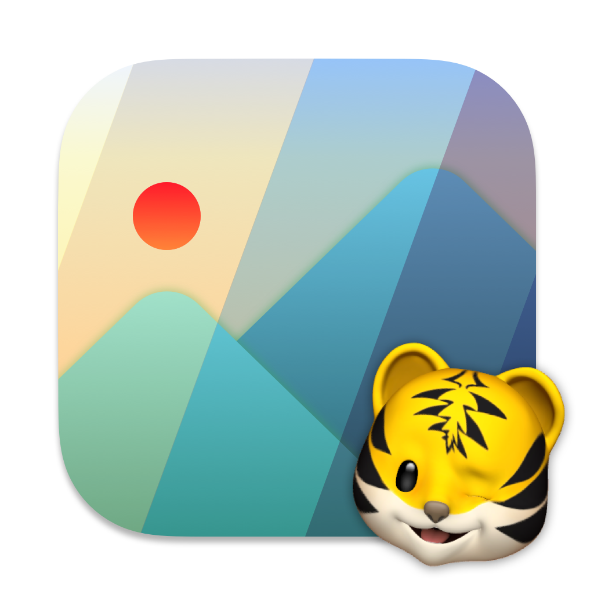
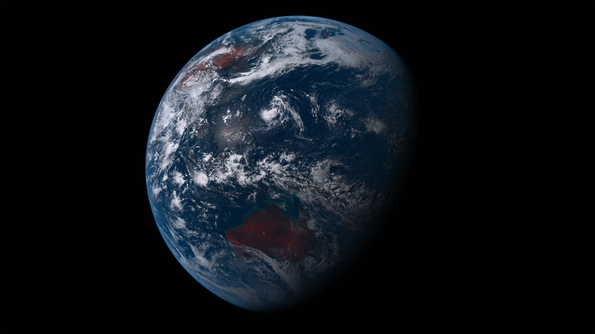
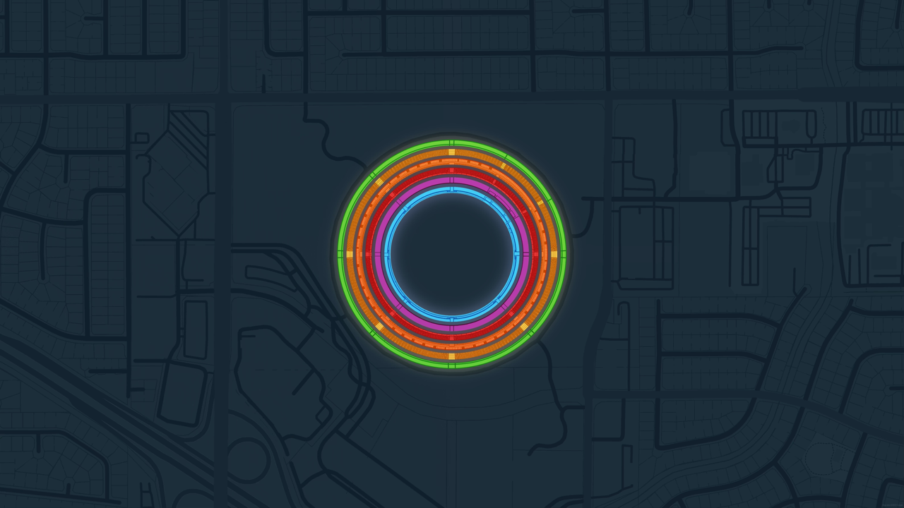

# 川虎壁纸 Chuanhu Wallpaper

   

A GUI for [Wallpapper](https://github.com/mczachurski/wallpapper), generates dynamic wallpapers for macOS.

本项目旨在为[Wallpapper](https://github.com/mczachurski/wallpapper)提供图形界面，能为 macOS 生成动态壁纸，包括按亮暗色模式切换、按太阳照射情况切换和按时间切换。

## 编译与安装

你可以去本项目的 [release 页面](https://github.com/GaiZhenbiao/ChuanhuWallpaper/releases/tag/v1.6) 下载最新版本。

最低系统要求 macOS 11.0 Big Sur，本项目使用 Xcode14 开发。

## 贡献者

[土川虎虎虎](https://space.bilibili.com/29125536)，开发者

[Keldos](https://github.com/Keldos-Li)，绘制了本 App 的图标，贡献者

## 示例

以下是壁纸示例：

### Hello（按亮暗色模式切换）

由 [Basic Apple Guy](https://basicappleguy.com/basicappleblog/hello-20) 绘制。[下载](https://www.icloud.com.cn/iclouddrive/012EtxZCzufN9Ci4RurixpoUg#hello)

### 夸父（按亮暗色模式切换）

这是联想小新的壁纸。[下载](https://www.icloud.com.cn/iclouddrive/051Yu23joU5LfVuy3Wd5YALrQ)

### 地球（按日照切换，来自 wallpapper）

[下载](https://www.icloud.com.cn/iclouddrive/03eLDbNObIa6N8b-4ghD7MWOw#Earth_View)

### Windows 11（按亮暗色模式切换）

[下载](https://www.icloud.com.cn/iclouddrive/0dd8CSI3QFfRxyAf9YlJs-fig#bloom)

### Cyberpunk（按日照切换，来自 wallpapper）

[下载](https://www.icloud.com.cn/iclouddrive/03eLDbNObIa6N8b-4ghD7MWOw#Earth_View)

### Apple Park（按亮暗色模式切换）

由 Basic Apple Guy 创作。[下载](https://www.icloud.com.cn/iclouddrive/0f0WOzeKYpARy9_8kAIJ7nuxg#ApplePark)

